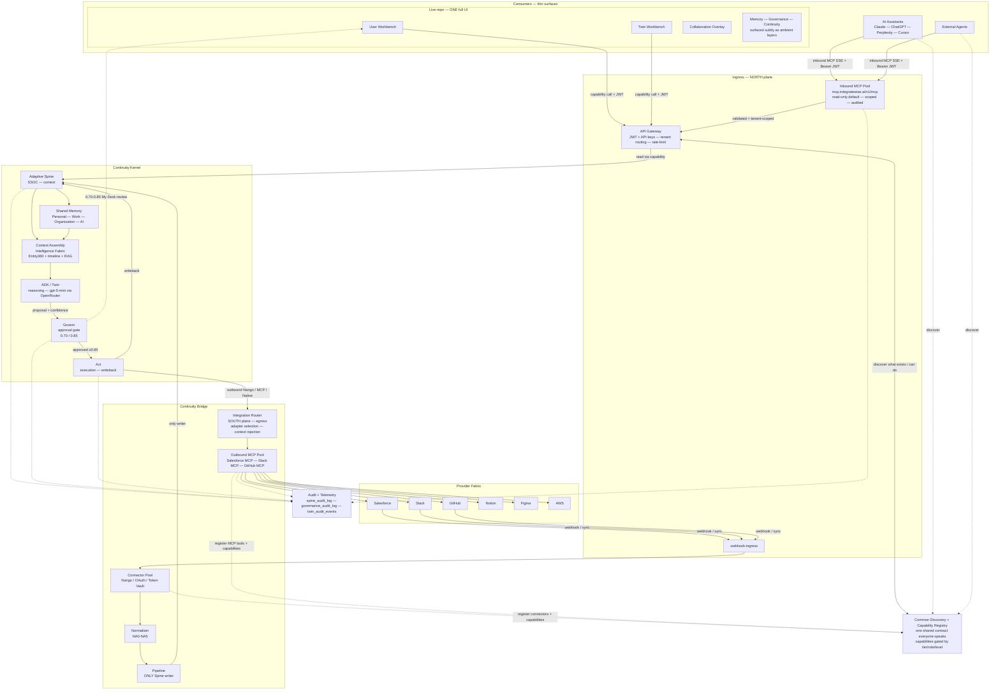

# IntegrateWise Continuity Bridge — Final End-to-End System

**Version:** 1.0.0-FINAL  
**Date:** 2026-07-02  
**Status:** LOCKED — all §14 conflicts resolved, all P0 blockers defined with closure criteria  
**Scope:** Multi-tenant continuity bridge, 26-service Cloudflare-native mesh, MCP-first ingress, governance-gated AI Twin  
**Canonical Reference:** [CANONICAL_PLATFORM_ARCHITECTURE.md](./architecture/CANONICAL_PLATFORM_ARCHITECTURE.md)

> This document is downstream of the Canonical Platform Architecture. When this document
> contradicts the canonical architecture, the canonical architecture wins.

---

## 1. The One-Liner

> **One JWT. One SSE connection. One Bridge. The Bridge connects to everything else.**

The IntegrateWise Continuity Bridge is a multi-tenant continuity ecosystem that preserves identity, context, memory, governance, and execution across all consumers (humans, AI assistants, apps, tools) through one stable continuity contract. Consumers never hold provider credentials, never import internal topology, and never bypass the governance gate.

**Doctrine:** _Truth you own. AI you rent. Approval in between._

**Product Name:** IW Continuity Bridge (DECISION 23 retired — "Platform" is the operational continuity platform, "Bridge" is the product name, "OS" and "tool" are explicitly rejected).  
**Category:** The Operational Continuity Platform

---

## 2. The Four Layers (Conceptual Law)

These layers are **conceptual** — they describe trust boundaries, not deployment units. The physical 0–16 topology is in §7.

```
Consumers  ↔  Continuity Bridge  ↔  Continuity Kernel  ↔  Provider Fabric
```

| Layer                 | What It Is                                                                                                                             | What Consumers See                                                     |
| --------------------- | -------------------------------------------------------------------------------------------------------------------------------------- | ---------------------------------------------------------------------- |
| **Consumers**         | Humans, AI assistants (ChatGPT, Claude, Perplexity, Cursor), apps, tools                                                               | A thin surface: one MCP connection, one web workbench, or one SDK call |
| **Continuity Bridge** | The public interface / the moat: identity, auth, discovery, projections, capabilities, governance entry, events                        | Identity, Discovery, Projections, Capabilities, Events                 |
| **Continuity Kernel** | The internal context substrate: Adaptive Spine, Memory, Knowledge, Context, Capability Engine, Governance, Workflow, Continuity Engine | Nothing — consumers never import internal topology                     |
| **Provider Fabric**   | Replaceable external execution: SaaS providers, databases, APIs, queues, agents, runtimes                                              | Nothing — the Fabric is entirely behind the Kernel                     |

**Invariant:** Consumers never import internal service topology. They see only Identity, Discovery, Projections, Capabilities, and Events.

---

## 3. The Universal Loop (Every Action Flows Through This)

```
Observe → Understand → Propose → Govern → Execute → Writeback → Evidence Return → Remember → Organize → Learn
```

Every consumer interaction resolves through five public concepts:

1. **Identity** — who are you? (Gateway JWT, `x-tenant-id`, `x-correlation-id`)
2. **Discovery** — what exists / what can I do? (`GET /api/v1/discovery`)
3. **Projections** — persona-specific views (Desk, Entity360, Executive, Twin, etc.)
4. **Capabilities** — named business actions (Analyze Account, Draft Email, …)
5. **Events** — Signal, Proposal, Approval, Outcome, Stream

---

## 4. The Two Planes (North / South)

```
Consumers → [API Gateway] → Spine (context) → [Integration Router] → Provider tools
             (north / ingress)                (south / egress)
```

| Plane     | Direction                          | Role                                                                                         | Physical Service                                      |
| --------- | ---------------------------------- | -------------------------------------------------------------------------------------------- | ----------------------------------------------------- |
| **North** | Ingress — consumers → platform     | AuthN/Z, tenant routing, rate-limit, capability routing, Discovery                           | `gateway` (single Worker)                             |
| **South** | Egress — platform → external tools | Adapter routing (Nango / MCP / Native), credential wall, health, Entity360 context injection | Integration Router (folded into §5 Continuity Bridge) |

**Rule:** Neither plane talks to the other except **through the Spine**. The Gateway and Integration Router are not alternatives — they are the only two doors, one in, one out.

---

## 5. MCP Pool Architecture (Bidirectional, First-Class)

MCP is not a single connection. It is a **multiplexed, bidirectional, tenant-scoped pool** with two distinct trust models.

### 5.1 Inbound MCP Pool (North Plane)

**Endpoint:** `mcp.integratewise.ai/v1/mcp` (SSE/stdio)  
**Role:** AI assistants (ChatGPT, Claude, Perplexity, Cursor) connect **to us** to read scoped Spine/Memory context.  
**Primary ingress:** This is the **primary** front door — AI assistants are the lead ecosystem category, ahead of traditional SaaS/webhook connectors.  
**Note:** `apps/mcp-server` is the deployable transport shell, and the downstream `mcp-connector` (`iw-mcp-connector` Worker binding) is the service it delegates to for Spine/Memory query resolution.

```
Inbound MCP Pool
├── mcp.integratewise.ai/v1/mcp (Cloudflare Worker — single deploy, multi-tenant)
│   ├── POST /sessions          — SSE transport negotiation, session lifecycle
│   ├── POST /tools             — Discovery-driven tool catalog (filtered per tenant)
│   ├── POST /invoke            — Capability execution (read-only default)
│   ├── GET /health             — Session + tenant health (SSE stream)
│   └── DELETE /sessions/:id    — Cleanup
│
├── Per-tenant scoping
│   ├── JWT validation (gateway-issued, NOT provider-issued)
│   ├── x-tenant-id extracted from JWT claim `tenant_id` (never from client payload)
│   ├── Tool catalog assembled from Discovery (§9) — tenant sees only their capabilities
│   └── Audit: `via: mcp` in `spine_audit_log` for every call
│
└── Security gates (P0 — must be closed before production)
    ├── 1. JWT bypass on /tools, /invoke, /mcp, /sessions → 403 (fail-loud)
    ├── 2. Cross-tenant session reuse → 403 (fail-loud, not 404)
    ├── 3. Read-only default: `scope: read` in JWT; write requires `scope: write` + governance approval
    ├── 4. Tool catalog filtered by Discovery: tenant cannot discover another tenant's tools
    └── 5. Every invocation logged to `spine_audit_log` with full request/response hash
```

**Consumer Config (Template):**

```json
{
  "mcpServers": {
    "integratewise": {
      "type": "sse",
      "url": "https://mcp.integratewise.ai/v1/mcp",
      "headers": {
        "Authorization": "Bearer ${input:integratewise_jwt}"
      },
      "description": "IntegrateWise Continuity Bridge — Spine, Memory, Knowledge, Signals, Proposals, Governance"
    }
  }
}
```

**Key rule:** There is **one** client-side MCP entry. Not 21. Not 5. One.

### 5.2 Outbound MCP Pool (South Plane)

**Location:** Inside the Integration Router (part of §5 Continuity Bridge)  
**Role:** We connect **to provider MCP servers** (Salesforce MCP, Slack MCP, GitHub MCP, etc.) using MCP as the transport.

```
Outbound MCP Pool (Integration Router)
├── Provider MCP Adapters
│   ├── Salesforce MCP Server
│   ├── Slack MCP Server
│   ├── GitHub MCP Server
│   ├── Notion MCP Server
│   ├── Figma MCP Server
│   └── Custom MCP Servers (tenant-defined)
│
├── Per-tenant context injection
│   ├── Entity360 fetched from Spine before every outbound call
│   ├── Context window optimization (Context Assembly, §19 / Layer 7)
│   └── Result normalized back to Spine schema via Normalizer
│
├── Adapter selection logic
│   ├── Nango (OAuth-mature SaaS): Salesforce, HubSpot, Stripe
│   ├── MCP (AI-native / tool-calling): GitHub, Linear, custom
│   └── Native (direct REST): legacy / custom APIs
│
└── Security gates
    ├── Credential wall: per-tenant API keys, never shared across tenants
    ├── Tool whitelist per tenant: no arbitrary tool calling
    ├── Health checks + circuit breaker per provider
    └── Audit: `outbound_mcp_calls` log with `tenant_id`, `provider`, `tool`, `latency`
```

**Rule:** The Integration Router is the **only** service that touches external APIs. Frontends, agents, and AI assistants never call provider tools directly.

### 5.3 Why "Pool" and Not "Server/Client"

| Property           | Inbound MCP Pool                                                 | Outbound MCP Pool                                                     |
| ------------------ | ---------------------------------------------------------------- | --------------------------------------------------------------------- |
| Multiplexed        | Many concurrent sessions per tenant                              | Many concurrent provider connections per tenant                       |
| Tenant-scoped      | Each session bound to JWT `tenant_id`                            | Each connection bound to tenant's credential wall                     |
| Replaceable        | Provider servers can be swapped without changing Bridge contract | Adapter can be swapped (Nango ↔ MCP ↔ Native) without consumer change |
| Read/write posture | Read-only default; write via governance                          | Write via governance; read via Entity360 injection                    |

### 5.4 Integration Manager (Pluggable Configuration & Adapter Selection)

The Integration Manager is the configuration center and adapter router that manages the pluggable architecture of the platform, routing and resolving capabilities (`domain.resource.operation`) across modular infrastructure.

Under this model:

- **D1 is Operational Only**: Cloudflare D1 acts strictly as an edge operational cache. It holds temporary cache records and is designed to be rebuilt from the central System of Record (SSOT).
- **Postgres / HyperDrive is the SSOT**: The authoritative, long-term relational truth (the Spine) resides in a swappable PostgreSQL database, which is accessed either directly or optimized via Cloudflare HyperDrive.

The Integration Manager enables complete component modularity across five key dimensions:

1.  **Frontend Replaceable**: Since frontends are pure projections of the Spine, the UI is entirely replaceable. The same capability endpoints can be rendered via Vite (Cloudflare Pages), Next.js (Vercel), Replit, Electron, or mobile surfaces.
2.  **Auth Swappable**: The identity layer is swappable. The system can run on gateway-issued JWTs, Clerk, Stack Auth, Descope, or enterprise SAML/SSO.
3.  **Postgres Swappable**: The relational storage backend is swappable. Tenants or operators can choose Neon PostgreSQL, Supabase PostgreSQL, AWS RDS, or custom self-hosted Postgres.
4.  **AI Provider Swappable**: Reasoning is decoupled from specific models. The AI layer can use `gpt-5-mini`, Anthropic Claude, Grok, local Ollama, or OpenRouter routing.
5.  **Deployment Swappable**: Runtimes are swappable. Services can deploy onto Cloudflare Workers, Vercel, AWS Serverless, or local/Docker container runtimes.

The Integration Manager dynamically maps these selections onto active adapters without affecting the downstream capability contract. The public interface remains stable while the underlying stack is completely pluggable.

---

## 6. The 26 Services (Physical Topology)

All services run on every deployment and serve **all tenants**. Customer-Zero is a _tenant class_, not a separate service. All 26 are wired into the Gateway as Cloudflare service bindings.

_Topology breakdown:_ Tier 0 (2) + Tier 1 (3) + Tier 2 (8) + Tier 3 (4) + Tier 4 (9) = 26 services.

### Tier 0 — Ingress & Routing

| Service           | Worker                  | Purpose                                                             | Service Binding   |
| ----------------- | ----------------------- | ------------------------------------------------------------------- | ----------------- |
| `gateway`         | `integratewise-gateway` | Single entry point; JWT validation; tenant routing; rate-limit      | N/A (entry point) |
| `webhook-ingress` | `iw-webhook-ingress`    | Receives external webhooks (Salesforce, HubSpot, Stripe, GitHub, …) | `WEBHOOK_INGRESS` |

> **Ingress priority:** AI assistants (inbound MCP) are the **primary** ingress class. Traditional SaaS/webhook connectors are secondary/complementary. Both feed the same normalization pipeline.

### Tier 1 — Tenant & Sync

| Service          | Worker              | Purpose                                                                                                             | Service Binding  |
| ---------------- | ------------------- | ------------------------------------------------------------------------------------------------------------------- | ---------------- |
| `tenants`        | `iw-tenants`        | Multi-tenant context resolution, tenant CRUD, SSO, plan limits                                                      | `TENANTS`        |
| `connector-sync` | `iw-connector-sync` | Orchestrates connector sync (fetch → Normalizer)                                                                    | `CONNECTOR_SYNC` |
| `normalizer`     | `iw-normalizer`     | 8-stage NA0–NA5 pipeline: schema detect → canonical transform → SSOC bind → lineage → relation bind → Spine publish | `NORMALIZER`     |

### Tier 2 — Projection & Rendering

| Service             | Worker                 | Purpose                                                   | Service Binding     |
| ------------------- | ---------------------- | --------------------------------------------------------- | ------------------- |
| `pipeline`          | `iw-pipeline`          | **Only writer to the Spine**; product/eng domain renderer | `PIPELINE`          |
| `twin-orchestrator` | `iw-twin-orchestrator` | Persistent per-user AI reasoning engine (Durable Object)  | `TWIN_ORCHESTRATOR` |
| `l2`                | `iw-l2`                | Department × industry overlay projections                 | `L2`                |
| `intelligence`      | `iw-intelligence`      | Analytics & insights renderer + signal generation         | `INTELLIGENCE`      |
| `knowledge`         | `iw-knowledge`         | Knowledge base, docs, semantic search                     | `KNOWLEDGE`         |
| `govern`            | `iw-govern`            | Governance rules engine (approval gates, HITL thresholds) | `GOVERN`            |
| `store`             | `iw-store`             | Persistence for projections (accounts, deals, tasks)      | `STORE`             |
| `act`               | `iw-act`               | Action execution / write-back to providers                | `ACT`               |

### Tier 3 — Capability Runtime & Orchestration

| Service            | Worker             | Purpose                                                                                                       | Service Binding    |
| ------------------ | ------------------ | ------------------------------------------------------------------------------------------------------------- | ------------------ |
| `hermes`           | `iw-hermes`        | Message queue + execution engine (Durable Object). Runs confidence triage and active-memory decay internally. | `HERMES`           |
| `workflow`         | `iw-workflow`      | Durable orchestration (pause, retry, saga)                                                                    | `WORKFLOW`         |
| `iw-agent-runtime` | `iw-agent-runtime` | MCP-compliant AI agent execution (gpt-5-mini default)                                                         | `IW_AGENT_RUNTIME` |
| `mcp-connector`    | `iw-mcp-connector` | MCP bridge: external agents → scoped Spine/Memory access                                                      | `MCP_CONNECTOR`    |

### Tier 4 — Supporting

| Service          | Worker              | Purpose                                                      | Service Binding  |
| ---------------- | ------------------- | ------------------------------------------------------------ | ---------------- |
| `agent-registry` | `iw-agent-registry` | Catalog of available agents/integrations                     | `AGENT_REGISTRY` |
| `billing`        | `iw-billing`        | Usage tracking + plan enforcement                            | `BILLING`        |
| `admin`          | `iw-admin`          | Platform admin (tenant mgmt, overrides)                      | `ADMIN`          |
| `loader`         | `iw-loader`         | Cold-start pre-loader; Nango webhook handler                 | `LOADER`         |
| `folder-watcher` | `iw-folder-watcher` | Durable Object filesystem watcher                            | `FOLDER_WATCHER` |
| `continuity`     | `iw-continuity`     | Memory consolidation + decay (the continuity substrate)      | `CONTINUITY`     |
| `telemetry`      | `iw-telemetry`      | Traces, metrics, observability                               | `TELEMETRY`      |
| `think`          | `iw-think`          | LLM reasoning orchestration (separate from iw-agent-runtime) | `THINK`          |
| `connector`      | `iw-connector`      | OAuth callback handler (Nango)                               | `CONNECTOR`      |

---

## 7. The 0–16 Stack (Physical Implementation Topology)

This is the **physical** view. The 4-layer law in §2 is the **conceptual** view. Both hold — 0–16 is the implementation map, 4-layer is the trust model.

| #   | Layer                       | Physical Services                                                  | Data / Storage                                                   |
| --- | --------------------------- | ------------------------------------------------------------------ | ---------------------------------------------------------------- |
| 0   | **Tenant Lifecycle**        | `tenants`, `loader`, `admin`                                       | D1 `tenants` table, `tenant_spine_config`                        |
| 1   | **Customer Ecosystem**      | `connector`, `connector-sync`, `agent-registry`                    | Nango tokens (vault), `connectors` table                         |
| 2   | **Surface Layer**           | `apps/web` (Vite), `apps/mcp-server`                               | Cloudflare Pages, R2 assets                                      |
| 3   | **Gateway Layer**           | `gateway`                                                          | N/A — pure routing                                               |
| 4   | **Identity & Organization** | `tenants` (SSO, RBAC)                                              | D1 `rbac_roles`, `rbac_permissions`                              |
| 5   | **Continuity Bridge**       | `connector-sync`, `normalizer`, `mcp-connector`, `webhook-ingress` | D1 `sync_jobs`, `normalizer_state`, KV Discovery cache           |
| 6   | **Adaptive Spine**          | `pipeline`                                                         | D1 (entities, relationships, SSOC), `spine_audit_log`            |
| 7   | **Context Assembly**        | `intelligence`, `knowledge`                                        | Vectorize (embeddings), AI Search (semantic), KV context cache   |
| 8   | **Shared Memory**           | `continuity`, `hermes`                                             | D1 `memory` (active/staging/archived), KV memory decay           |
| 9   | **Capability Engine**       | `iw-agent-runtime`, `think`                                        | OpenRouter API (gpt-5-mini default), KV model config             |
| 10  | **Governance Layer**        | `govern`                                                           | D1 `governance_audit_log`, `action_proposals`                    |
| 11  | **Capability Runtime**      | `hermes`, `workflow`, `act`, `mcp-connector`                       | Durable Objects (stateful), Queues (ACT_QUEUE, PIPELINE_QUEUE)   |
| 12  | **Projection Registry**     | `l2`, `store`                                                      | D1 `projections`, `projection_registry`                          |
| 13  | **Registry Layer**          | `agent-registry`, `intelligence` (catalog)                         | D1 `capability_registry`, `endpoint_registry`, KV registry cache |
| 14  | **Continuity Engine**       | `continuity`, `twin-orchestrator`                                  | D1 `continuity_graph`, KV session handoffs                       |
| 15  | **Data & Infrastructure**   | `telemetry`, `folder-watcher`                                      | D1 `audit_logs`, R2 (telemetry blobs), Workers Analytics         |
| 16  | **Endpoint Registry**       | `gateway` (serves), `intelligence` (updates)                       | KV + D1 `endpoint_registry` (living API contract)                |

**Cross-cutting:** Security (WAF, DDoS, TLS, CF Secrets, Zero Trust), Observability (logs/metrics/traces/alerts/audit), Reliability (idempotency, retries, DLQ, backpressure), Compliance (audit & lineage, retention, field-level security, encryption, tenant isolation).

---

## 8. End-to-End: First Connection Flow

### 8.1 New Tenant Onboarding (First Auth)

1. **Identity provider** (Google / GitHub / email) → trust root established.
2. **Gateway** issues JWT with `tenant_id` claim.
3. **Schema-generation AI** (gpt-5-mini) hydrates tenant on first auth: entity types, relationships, RBAC roles (owner/tam/account_success), billing tier.
4. **Tenant init:** D1 partition, `tenant_spine_config` row, RBAC rows, billing record, memory tables created.
5. **Target:** signup → workspace < 5 min; first tool connected < 10 min; normalizer p99 < 2s.

### 8.2 Connecting the First Tool (Salesforce Example)

| Step | Actor               | Action                                                                                                                            | Service                              | Data Store                                        |
| ---- | ------------------- | --------------------------------------------------------------------------------------------------------------------------------- | ------------------------------------ | ------------------------------------------------- |
| 1    | User                | Clicks "Connect Salesforce"                                                                                                       | `apps/web`                           | —                                                 |
| 2    | Frontend            | `POST /api/v1/connector/nango/session` + `x-tenant-id`                                                                            | `gateway` → `connector`              | —                                                 |
| 3    | Connector           | Creates Nango session token (`connectionId = tenant_id`)                                                                          | `connector`                          | Nango vault                                       |
| 4    | Nango               | Opens Connect UI; user authorizes; tokens captured                                                                                | Nango (external)                     | —                                                 |
| 5    | Loader              | Receives `auth.created` webhook; verifies signature                                                                               | `loader`                             | D1 `tenant_spine_config.connected_connectors`     |
| 6    | Loader              | Triggers immediate "creamy" (full) sync; no 6h cron wait                                                                          | `loader` → `connector-sync`          | `CONNECTOR_SYNC_QUEUE`                            |
| 7    | Connector-sync      | Resolves Nango token; calls provider adapter; returns raw records                                                                 | `connector-sync`                     | Nango vault (read)                                |
| 8    | Normalizer          | 8-stage NA0–NA5: schema detect → canonical transform (traits) → SSOC bind (stable UUID) → lineage → relation bind → Spine publish | `normalizer`                         | D1 `normalizer_state`                             |
| 9    | Pipeline            | **Only Spine writer:** `INSERT` entities + relationships; writes audit log                                                        | `pipeline`                           | D1 `entities`, `relationships`, `spine_audit_log` |
| 10   | Intelligence / Twin | Twin reads Spine (`WHERE tenant_id = ?`), reasons with gpt-5-mini, emits proposal                                                 | `twin-orchestrator`, `think`         | OpenRouter API                                    |
| 11   | Governance          | Confidence score evaluated: ≥0.85 auto; 0.70–0.85 → My Desk; <0.70 discard                                                        | `govern`                             | D1 `action_proposals`, `governance_audit_log`     |
| 12   | My Desk             | Owner reviews proposal; approves/rejects                                                                                          | `apps/web`                           | D1 `action_proposals` (status update)             |
| 13   | Act                 | Approved action routed to `act` → Integration Router → Salesforce                                                                 | `act`                                | `ACT_QUEUE`                                       |
| 14   | Writeback           | Outcome written to Spine; audit emitted; memory compounds                                                                         | `pipeline` (writeback), `continuity` | D1 `entities`, `spine_audit_log`, `memory`        |

---

## 9. The Discovery Contract (Consumer Surface)

**Endpoint:** `GET /api/v1/discovery`  
**Cache:** Client-side 5 min  
**Purpose:** How humans and AI agents learn "what exists / what can I do" without hardcoding topology.

**Response includes:**

- `identity` — user, tenant, org, role
- `workspace` — tenant config, connected connectors, plan limits
- `projections` — available lenses (Sales, CS, Finance, Executive, Architecture, Operations, Personal, Developer)
- `capabilities` — named actions filtered by tier/role/level (e.g., `analyze_account`, `draft_email`, `get_department_health`)
- `features` — gated by plan (free/pro/enterprise)
- `navigation` — role-based menu structure
- `personalization` — user preferences, recent context
- `limits` — rate limits, storage quotas, model quotas

**AI agents read the same Discovery response as humans.** This is the contract that makes cross-component communication effective and drift-proof.

---

## 10. Governance & Approval Gate (The 0.70/0.85 Law)

### 10.1 Governance Triage (Execution Gate)

| Confidence  | Action            | Destination            | Audit                                  |
| ----------- | ----------------- | ---------------------- | -------------------------------------- |
| ≥ 0.85      | Auto-approve      | `ACT_QUEUE`            | `governance_audit_log` (auto-approved) |
| 0.70 – 0.85 | Queued for review | My Desk (owner review) | `governance_audit_log` (pending)       |
| < 0.70      | Discard           | —                      | `governance_audit_log` (discarded)     |

- Even Customer-Zero cannot bypass hard approval-expiry gates.
- **Customer-Zero posture:** Hermes native auto-execute (for internal operations only).
- **External tenant posture:** Async Handoff contract only (`/api/v1/handoff/outcome`, validated `x-approval-token`).

### 10.2 Memory Triage (Knowledge Gate)

| Confidence  | Action       | Destination    | Where                                            |
| ----------- | ------------ | -------------- | ------------------------------------------------ |
| ≥ 0.85      | Auto-promote | Active memory  | `continuity` (TriageBot running inside `hermes`) |
| 0.70 – 0.85 | Staging      | Staging memory | `continuity`                                     |
| < 0.70      | Discard      | —              | `continuity`                                     |

- **Active memory decay:** If not reinforced, decays and archives after ~30 days of no access.
- **Memory scopes (FINAL):** `Personal` (human), `Work` (task/project), `Organization` (org-wide), `AI` (twin). Audit is cross-cutting Compliance, not a memory scope.

---

## 11. Memory Lifecycle (Continuity Engine)

The Continuity Engine runs 7 stages:

```
Memory Intake → Classification → Validation → Promotion → Memory Store → Continuity Graph → Memory Decay
```

- **Intake:** Raw signals from Pipeline, Act, Twin, user actions.
- **Classification:** TriageBot scores confidence (0–1.0).
- **Validation:** Deduplication against SSOC (stable UUIDs); lineage verification.
- **Promotion:** ≥0.85 → active; 0.70–0.85 → staging; <0.70 → discard.
- **Memory Store:** Active / staging / archived tiers in D1 + KV cache.
- **Continuity Graph:** Relationship traversal — who/what/when/where connected.
- **Decay:** Time-decay + access-decay; archive after ~30 days; reinforcement resets clock.

**Every agent turn starts with more context than the last.** This is compounding memory.

---

## 12. AI / Twin / Reasoning Layer

### 12.1 Model Provider (The "AI You Rent")

- **Default:** gpt-5-mini via **OpenRouter** (aggregator)
- **Swappable:** OpenAI, Anthropic, Google, Grok — config change, not migration
- **Binding:** Consumers call capabilities (`twin/propose`, `insights`, `predictions`), never model names
- **Per-tenant/per-capability model selection:** Cheap model for triage, strong model for high-stakes proposals, provider failover

**Resolution of §14.8:** DECISION 30 (Grok) is **superseded** by §23 FINAL. Twin default = gpt-5-mini via OpenRouter. Grok is available as a config option, not the default.

### 12.2 Agent Services

| Service             | Role                                                         |
| ------------------- | ------------------------------------------------------------ |
| `twin-orchestrator` | Persistent per-user Twin — reasoning engine (Durable Object) |
| `iw-agent-runtime`  | MCP-compliant AI agent execution                             |
| `think`             | LLM reasoning orchestration (SDK abstraction layer)          |
| `mcp-connector`     | Inbound MCP bridge — external agents → scoped Spine/Memory   |
| `agent-registry`    | Catalog of available agents / integrations                   |

### 12.3 Agent Tools (Capabilities)

- `analyze_metric`
- `get_metric_data`
- `get_recommendations`
- `generate_forecast`
- `compare_metrics`
- `create_action_plan`
- `get_department_health`

### 12.4 A2A (Agent-to-Agent)

**Status:** Month-6 roadmap. Today: agents coordinate through **shared Spine context** via Twin — the Spine is the shared blackboard. No peer-to-peer calls. Every agent reads/writes the same Spine, gated by `tenant_id` and JWT scope.

---

## 13. Multi-Tenancy & Isolation (Hard Rules)

1. **Every query carries `WHERE tenant_id = ?`.** Cross-tenant access = security violation → 403 (fail-loud, not 404).
2. **Nango credentials isolated per tenant:** `connectionId = tenant_id`, encrypted in vault. No shared tokens.
3. **Org is the hard isolation boundary.** Sharing happens _within_ an org across departments/lenses.
4. **Gateway enforces `x-tenant-id` extraction from JWT.** Never from client payload, never from URL parameter, never from header injection.
5. **Service bindings carry `tenant_id` implicitly.** Every internal RPC includes the caller's tenant context.

---

## 14. Audit & Observability (Immutable, Fail-Loud)

| Table                  | What It Logs                                    | Failure Behavior               |
| ---------------------- | ----------------------------------------------- | ------------------------------ |
| `audit_logs`           | Generic events                                  | Write failure → halt operation |
| `governance_audit_log` | Approval decisions (approve/reject/discard)     | Write failure → halt operation |
| `spine_audit_log`      | Entity changes, MCP access, reads, writes       | Write failure → halt sync      |
| `twin_audit_events`    | Reasoning trace, model calls, confidence scores | Write failure → halt proposal  |
| `outbound_mcp_calls`   | Provider calls, latency, errors                 | Write failure → circuit break  |

**Rule:** Audit write failure stops the sync. No silent drops. Telemetry service (`telemetry`) collects traces/metrics from all workers.

---

## 15. Public Contract Surface (What Consumers Call)

| Endpoint                                                                                  | Purpose                          | Auth                        |
| ----------------------------------------------------------------------------------------- | -------------------------------- | --------------------------- |
| `GET /api/v1/discovery`                                                                   | Capability handshake             | Gateway JWT                 |
| `POST /api/v1/handoff/outcome`                                                            | Async external execution results | `x-approval-token`          |
| `POST /api/v1/connector/nango/session`                                                    | Initiate OAuth connection        | Gateway JWT + `x-tenant-id` |
| `GET /api/v1/{workspace,connector,intelligence,knowledge,cognitive,pipeline,admin,mcp}/*` | Tiered capability routing        | Gateway JWT                 |
| `mcp.integratewise.ai/v1/mcp`                                                             | MCP SSE transport                | Bearer JWT                  |

**SDK:** `packages/api-client` (Gateway SDK, complete) + `packages/sdk` (consumer facade).

---

## 16. Frontend Surfaces (Projection Platform)

The live repo ships **one full UI** — not many apps:

- **User Workbench** — role-based L1 domain workbenches
- **Twin Workbench** — AI reasoning interface, proposal review
- **Collaboration Overlay** — ambient memory, governance, continuity signals
- **My Desk** — approval interface (0.70–0.85 proposals)
- **Real-time metrics dashboard**

**Projections (FINAL lens taxonomy):** Sales, CS, Finance, Executive, Architecture, Operations, Personal, Developer.

**Frontend host:** `apps/web` (Vite, React, shadcn/ui). Deployed to Cloudflare Pages. Not Next.js/Vercel. Not Replit. The UI is an agnostic dimension (§21.2), but the template default is Vite on Cloudflare Pages.

---

## 17. Deployment Topology (100% Cloudflare)

**Runtime:** Workers (all 26 services), Durable Objects (stateful: Twin, Hermes, Folder Watcher), D1 (relational), KV (cache, registry), R2 (blobs, telemetry), Vectorize (embeddings), AI Search (semantic), Queues (PIPELINE_QUEUE, ACT_QUEUE, CONNECTOR_SYNC_QUEUE), Workflows (durable orchestration), Pages (frontend).

**No Supabase.** No Vercel. No AWS backend. No Neon PostgreSQL. DECISION 22 is complete in the template; live migration is tracked as P1 #1.

**CI/CD gap:** No GitHub Actions gate today. Required: unified pipeline, pre-deploy test/typecheck, semantic versioning, rollback. Target: `wrangler deploy` through a GitHub Actions gate with pnpm workspace caching.

**Folder Monitor bridge:** macOS chokidar watcher → Cloudflare Folder Watcher DO → `spine_audit_log` + AI Search. Powers the Agent Continuity Protocol (session handoffs → triage → org memory).

---

## 18. Registry Layer (§13 — New Structure)

Everything the ecosystem can do is **cataloged**:

- **Connector Registry** — Nango, MCP, Native adapters
- **MCP Registry** — Inbound/outbound MCP servers, health status
- **Tool Registry** — Provider tool schemas, versions, deprecation
- **Capability Registry** — Named business actions (Analyze Account, Draft Email, …)
- **Skill Registry** — Agent skills (analyze_metric, …)
- **Agent Registry** — Available agents, runtime status
- **Provider Registry** — External providers (Salesforce, Slack, …)
- **Endpoint Registry** — Living API contract: path/method, service owner, auth type, status, surface access, change summary (cached in KV + D1)
- **Schema Registry** — Entity schemas, versions, migration history
- **Policy Registry** — Governance rules, approval thresholds, HITL policies

**Discovery reads from these registries.** Agents, frontends, docs, and tests all read the same Endpoint Registry to stay drift-proof.

---

## 19. Context Assembly (Intelligence Fabric — §7)

The RAG layer feeding the Twin:

1. **Entity resolution** — SSOC lookup, stable UUID binding
2. **Memory retrieval** — active memory query, recency + relevance scoring
3. **Relationship traversal** — Continuity Graph walk (entity → relation → entity)
4. **Tool retrieval** — Capability Registry lookup for available actions
5. **Capability discovery** — What can this tenant do right now?
6. **Prompt assembly** — Structured prompt with Entity360 + memory + tools
7. **Context-window optimization** — Truncation/prioritization to fit model limits
8. **Evidence retrieval** — Audit trail, lineage, confidence scoring for past decisions

---

## 20. Security Posture (P0 & P1)

### 20.1 Tenant Safety (Must Close Before Production)

| #   | Vulnerability                                              | Fix                                                                              | Owner                     |
| --- | ---------------------------------------------------------- | -------------------------------------------------------------------------------- | ------------------------- |
| 1   | Cross-tenant data leak (intelligence)                      | `WHERE tenant_id = ?` on every query; 403 fail-loud                              | `intelligence`            |
| 2   | Tenant-id spoofing (unstripped `x-tenant-id`)              | Extract from JWT only; reject client-provided                                    | `gateway`                 |
| 3   | Tenant middleware no-op                                    | Enforce `gateway` → all services binding includes `tenant_id`                    | `gateway`                 |
| 4   | HITL Durable Object using `idFromName("global")`           | Use `idFromName(\`${tenant_id}:${user_id}\`)` to prevent concatenation collision | `govern`                  |
| 5   | Invitation cross-tenant scan                               | Add `WHERE tenant_id = ?` to invitation lookup                                   | `tenants`                 |
| 6   | Hardcoded RSA key / DB creds / MCP key / WebUI password    | Move to Cloudflare Secrets; rotate                                               | `admin`                   |
| 7   | `.env` committed                                           | Remove from git; add to `.gitignore`; scan history                               | `admin`                   |
| 8   | SQL injection in continuity/knowledge shims                | Use Drizzle ORM parameterized queries                                            | `continuity`, `knowledge` |
| 9   | MCP-JWT bypass on `/tools`, `/invoke`, `/mcp`, `/sessions` | Require `Authorization: Bearer <jwt>`; verify signature                          | `mcp-connector`           |
| 10  | Auth root thrashing (Clerk/Stack/Descope)                  | **Freeze on API Keys + JWT**; remove all other auth imports                      | `gateway`                 |

### 20.2 Hardening (Post-Production)

| #   | Vulnerability                   | Fix                                              | Owner             |
| --- | ------------------------------- | ------------------------------------------------ | ----------------- |
| 1   | Billing still on Supabase       | Migrate to D1 + Workers billing                  | `billing`         |
| 2   | Gateway rate-limiter fails open | Add Cloudflare Rate Limiting; fail-closed        | `gateway`         |
| 3   | CORS reflects arbitrary origins | Whitelist `app.integratewise.ai` + Pages domains | `gateway`         |
| 4   | MCP JWT bypass                  | Close P0 #9 first                                | `mcp-connector`   |
| 5   | Unsigned-webhook auto-approve   | Verify Nango webhook signatures; reject unsigned | `loader`          |
| 6   | Webhook replay/timing leaks     | Add idempotency keys; deduplicate                | `webhook-ingress` |
| 7   | Weak password hashing           | Argon2id via Cloudflare Workers                  | `tenants`         |
| 8   | Remove `@supabase/supabase-js`  | DECISION 22 completion                           | All services      |

---

## 21. The Ownership Split (Context vs. Mechanism)

| What                                                                   | Who Owns It                                  | Access                                           |
| ---------------------------------------------------------------------- | -------------------------------------------- | ------------------------------------------------ |
| **Context** — data/entities in the Spine                               | **Customer organization** (data sovereignty) | Admin views/manages org's Spine via capabilities |
| **Mechanism** — Spine schema, Schema AI, Normalizer, Continuity Engine | **IntegrateWise (proprietary IP)**           | Not shared, not exposed to tenant                |

This split is possible because consumers reach context **through capabilities**, never through the schema. One boundary delivers sovereignty, IP protection, and swappability simultaneously.

---

## 22. Consumer Contract Summary (The "One Connection" Rule)

**What a consumer (human, AI assistant, app) needs to connect:**

1. **One JWT** — issued by the Gateway, bound to a tenant.
2. **One SSE endpoint** — `mcp.integratewise.ai/v1/mcp` (for AI assistants) or `https://api.integratewise.ai` (for apps).
3. **One Discovery call** — `GET /api/v1/discovery` to learn what they can do.

**What they do NOT need:**

- Provider credentials (Salesforce, GitHub, AWS, …) — held by the Integration Router.
- Multiple MCP connections — the Bridge routes to 20+ providers internally.
- Knowledge of internal topology — 26 services, D1 schema, DO IDs are all hidden.
- Auth provider accounts — Descope is the canonical external identity and connection authorization authority; gateway-issued JWTs and service API keys remain the internal auth mechanism. Clerk and Stack Auth are not used.

---

## 23. Resolution of All §14 Conflicts

| Conflict                                          | v1.0 FINAL Decision                                                                                                                                                                                                                                               | Status     |
| ------------------------------------------------- | ----------------------------------------------------------------------------------------------------------------------------------------------------------------------------------------------------------------------------------------------------------------- | ---------- |
| §14.1 Storage/runtime (4 backends)                | **100% Cloudflare** — D1, DO, KV, R2, Vectorize, AI Search, Queues. No Supabase/Vercel/AWS/Neon.                                                                                                                                                                  | **Locked** |
| §14.2 Auth model (Clerk vs JWT)                   | Internal: **API Keys (external) + JWT (internal)**, service bindings internal, same code path. External identity + outbound connection authorization: **Descope is the canonical authority** (Clerk/Stack Auth removed; Nango retained as dormant compatibility). | **Locked** |
| §14.3 Frontend host                               | `apps/web` (Vite + React + shadcn/ui) on Cloudflare Pages. Not Next.js. Not Replit.                                                                                                                                                                               | **Locked** |
| §14.4 Product framing ("not a platform")          | DECISION 23 **superseded**. Product = "IW Continuity Bridge"; Category = "The Operational Continuity Platform".                                                                                                                                                   | **Locked** |
| §14.5 Layer model (4-layer vs 10-layer vs L0-L3)  | **4-layer = conceptual law** (§2); **0-16 = physical topology** (§7); 10-layer and L0-L3 **retired**.                                                                                                                                                             | **Locked** |
| §14.6 Capability-first APIs                       | Named endpoints: `entity/:type/:id`, `memory/query`, `twin/propose`, `signals`, `insights`, `predictions`, `handoff`, `stream` (WS), `mcp`, `health`.                                                                                                             | **Locked** |
| §14.7 Domains                                     | `integratewise.ai` (canonical). `integrate-voice.ai` (GTM landing) is a redirect to main.                                                                                                                                                                         | **Locked** |
| §14.8 Twin model provider                         | **gpt-5-mini via OpenRouter** (default). Grok available as config option. DECISION 30 superseded.                                                                                                                                                                 | **Locked** |
| §18.2 "Platform" branding vs DECISION 23          | Platform = category; Bridge = product name. Both coexist.                                                                                                                                                                                                         | **Locked** |
| §18.3 Integration Manager vs existing services    | Folded into §5 Continuity Bridge (Connector Pool + MCP Pool + Discovery Catalog + Normalization + Schema AI). Not a separate 4th service.                                                                                                                         | **Locked** |
| §18.4 One-auth vs per-tool Nango                  | **Both, at different layers:** "Connect Once" at surface; **Descope is the canonical outbound authorization authority** underneath (Nango retained as dormant compatibility for providers Descope outbound does not yet support).                                 | **Locked** |
| §18.5 Lens naming                                 | **8 lenses (FINAL):** Sales, CS, Finance, Executive, Architecture, Operations, Personal, Developer.                                                                                                                                                               | **Locked** |
| §18.6 ADK vs Twin naming                          | **ADK is canonical** — lives in §11 Capability Runtime alongside Twin. No clash.                                                                                                                                                                                  | **Locked** |
| §20.3 "Platform" in title vs DECISION 23          | DECISION 23 retired. Title = "Platform Architecture".                                                                                                                                                                                                             | **Locked** |
| §20.3 Numbered (0-16) vs un-numbered (names)      | **Names for doctrine, numbers for implementation topology** — both canonical, different purposes.                                                                                                                                                                 | **Locked** |
| §20.3 Lens taxonomy mismatch (mindmap vs diagram) | **8 lenses above** adopted.                                                                                                                                                                                                                                       | **Locked** |
| §20.3 Memory scopes (3 sets)                      | **FINAL:** Personal, Work, Organization, AI. Audit = cross-cutting Compliance.                                                                                                                                                                                    | **Locked** |
| §21.3 Twin reframed as Operational Participant    | Adopted: "always working, never idle, accountable like an employee."                                                                                                                                                                                              | **Locked** |
| §22.4 L1-L4 definitions                           | **Pinned:** L1 = projection/read, L2 = intelligence/insight, L3 = operation/execution, L4 = full continuity/autonomous participation.                                                                                                                             | **Locked** |

---

## 24. The Mermaid Wiring Diagram (Canonical)



### How to Read the Diagram

- **North plane (ingress):** All consumers — UI, AI assistants (inbound MCP), external agents — enter through the **Gateway** or **Inbound MCP Pool**, authenticated, scoped to `tenant_id`, and served the **common Discovery + Capability Registry**.
- **One full UI:** User Workbench + Twin Workbench + Collaboration Overlay, with Memory, Governance, Continuity as ambient layers.
- **Ingest path:** Providers push → Connector Pool → Normalizer → Pipeline. **Pipeline is the only Spine writer.**
- **Reason → Govern → Act:** Spine → Context Assembly → Twin → Govern (confidence gate) → Act → Integration Router (Outbound MCP Pool) → Providers. Entity360 context injected on outbound.
- **Writeback + Memory:** Every outcome writes back to Spine; Memory compounds and feeds Context Assembly on the next turn.
- **Two invariants:** (1) Spine is the **only** place context is written; (2) Gateway and Integration Router are the **only** two doors — one in, one out — with Spine between them.

---

## 25. GTM & Positioning (From Strategy Session)

### Category & Positioning

- **Category claim:** "The Operational Continuity Platform — the infrastructure layer that preserves context, memory, and governance across every tool, every person, and every AI."
- **Competitive frame:** high structure × high intelligence × human-first workbench. "They connect apps; we connect context."
- **Anti-positioning:** Not "AI-powered platform," not "no-code automation," not "replace your tools," not "chat with your data." Instead: human workbench + assistive AI + governed context.

### Tagline Hierarchy

| Level      | Line                                                                 |
| ---------- | -------------------------------------------------------------------- |
| Category   | The Operational Continuity Platform                                  |
| Product    | IW Continuity Bridge                                                 |
| Promise    | Nothing important is forgotten                                       |
| Action     | The last auth for endless continuity / One click to total continuity |
| Proof      | One workbench. Full continuity. Zero context loss.                   |
| Philosophy | Human workbench. Assistive AI. Governed context.                     |

### Customer-Zero GTM (Acme Corp)

- **Two-app kill shot:** Salesforce + Slack, read-only, approval-required, 90-day retention.
- **Win condition:** One workspace auth → CS Workbench shows cross-system account context in < 60s → Twin proposes ≥1 insight/day → VP CS answers "what's our risk?" without opening Salesforce or Slack → adding a 3rd app is an "enable" toggle, not a project.
- **Distribution:** Through AI assistant marketplaces (ChatGPT GPT Store, Claude connectors, Perplexity apps) — we list as an MCP app, users discover inside the assistant they already use.
- **Do NOT build for CZ:** marketplace UI, partner portal, public connector directory, per-app OAuth flows, frontend→app direct calls.

---

## 26. Template Repo Structure (Publishable)

```
integratewise-continuity-bridge/
├── apps/
│   ├── gateway/              # Hono + JWT + tenant routing + service bindings map
│   │   ├── src/
│   │   │   ├── index.ts      # Entry point; route map to 26 bindings
│   │   │   ├── auth.ts       # JWT verify + tenant_id extraction
│   │   │   ├── discovery.ts  # Discovery assembly from registries
│   │   │   └── bindings.ts   # Service binding type definitions
│   │   ├── wrangler.toml
│   │   └── package.json
│   │
│   ├── workbench/            # Vite + React + shadcn/ui
│   │   ├── src/
│   │   │   ├── main.tsx
│   │   │   ├── components/   # shadcn components
│   │   │   ├── hooks/        # useWorkbenchAI, useAIInsights, useAIAgent
│   │   │   ├── projections/  # 8 lens implementations
│   │   │   └── desk/         # My Desk approval interface
│   │   ├── wrangler.toml     # Cloudflare Pages deploy
│   │   └── package.json
│   │
│   └── mcp-server/           # Inbound MCP Pool (single Worker, multi-tenant)
│       ├── src/
│       │   ├── index.ts      # SSE transport setup
│       │   ├── sessions.ts   # Session lifecycle (KV-backed)
│       │   ├── tools.ts      # Discovery → tool catalog assembly
│       │   ├── invoke.ts     # Capability routing via service binding
│       │   └── guard.ts      # JWT verify + tenant_id + read-only gate
│       ├── wrangler.toml
│       └── package.json
│
├── packages/
│   ├── spine-schema/         # Drizzle ORM + D1 driver + tenant_id helpers
│   │   ├── src/
│   │   │   ├── schema/       # All D1 tables (entities, relationships, memory, audit...)
│   │   │   ├── helpers.ts    # withTenant(query, tenantId)
│   │   │   └── migrations/   # D1 migration files
│   │   └── package.json
│   │
│   ├── normalizer/           # NA0–NA5 pipeline skeleton
│   │   ├── src/
│   │   │   ├── stages/
│   │   │   │   ├── na0-detect.ts
│   │   │   │   ├── na1-transform.ts
│   │   │   │   ├── na2-ssoc.ts
│   │   │   │   ├── na3-lineage.ts
│   │   │   │   ├── na4-relations.ts
│   │   │   │   └── na5-publish.ts
│   │   │   └── index.ts
│   │   └── package.json
│   │
│   ├── integration-manager/  # Pluggable Auth, DB (Postgres/D1), and Deployment configuration router
│   │   ├── src/
│   │   │   ├── auth-router.ts   # Resolves Clerk vs. standard JWT
│   │   │   ├── db-router.ts     # Routes to D1 or custom Neon/Supabase Postgres
│   │   │   ├── deploy-router.ts # Configures target platform settings
│   │   │   └── index.ts
│   │   └── package.json
│   │
│   ├── sdk/                  # @integratewise/sdk — consumer facade
│   │   ├── src/
│   │   │   ├── client.ts     # Gateway SDK
│   │   │   ├── discovery.ts  # Discovery response types
│   │   │   ├── capabilities.ts # Capability call wrappers
│   │   │   └── mcp.ts        # MCP client helpers
│   │   └── package.json
│   │
│   ├── mcp-types/            # Shared MCP schemas (inbound + outbound)
│   │   ├── src/
│   │   │   ├── inbound.ts    # Session, Tool, Invoke, Health types
│   │   │   ├── outbound.ts   # ProviderAdapter, ContextInjection types
│   │   │   └── guards.ts     # JWT claims, TenantScope, ReadOnlyGate
│   │   └── package.json
│   │
│   └── twin-types/           # Shared Twin/ADK types
│       ├── src/
│       │   ├── proposal.ts   # Proposal + ConfidenceScore
│       │   ├── governance.ts # ApprovalState, GovernanceEvent
│       │   └── memory.ts     # MemoryScope, MemoryTier, DecayRule
│       └── package.json
│
├── services/                 # 26 service stubs as Cloudflare Worker templates
│   ├── tier-0-ingress/       # gateway, webhook-ingress
│   ├── tier-1-tenant/        # tenants, connector-sync, normalizer
│   ├── tier-2-projection/    # pipeline, twin-orchestrator, l2, intelligence, knowledge, govern, store, act
│   ├── tier-3-runtime/       # hermes, workflow, iw-agent-runtime, mcp-connector
│   └── tier-4-support/       # agent-registry, billing, admin, loader, folder-watcher, continuity, telemetry, think, connector
│
├── infra/
│   ├── wrangler.toml          # Root config; service bindings for all 26
│   ├── d1-migrations/         # Tenant isolation schema (run once per env)
│   ├── kv-namespaces/         # Discovery cache, Endpoint Registry, Session store
│   └── queues/                # PIPELINE_QUEUE, ACT_QUEUE, CONNECTOR_SYNC_QUEUE definitions
│
├── scripts/
│   ├── mcpflare-aggregator.mjs   # Local MCP aggregator (dev only)
│   └── integratewise-mcp-bridge.mjs # stdio bridge for local AI assistants
│
├── docs/
│   ├── FINAL_E2E_SYSTEM.md   # This document
│   ├── ARCHITECTURE.md         # 4-layer conceptual law
│   ├── SECURITY.md             # P0/P1 hardening checklist
│   └── API.md                  # Endpoint Registry documentation
│
├── README.md
├── package.json               # pnpm workspace root
├── pnpm-workspace.yaml
├── tsconfig.json
└── .github/
    └── workflows/
        └── deploy.yml          # CI/CD: typecheck → test → wrangler deploy
```

---

## 27. Closing Checklist (Before Publish)

- [ ] Close P0 #1–10 (§20)
- [ ] Remove all `@supabase/supabase-js` imports (DECISION 22)
- [ ] Remove all Clerk/Stack Auth/Descope imports (§20.2)
- [ ] Lock MCP-JWT on all inbound endpoints (`/tools`, `/invoke`, `/mcp`, `/sessions`)
- [ ] Implement `withTenant()` helper on all D1 queries (packages/spine-schema)
- [ ] Hard `WHERE tenant_id = ?` in every service query
- [ ] Fix HITL DO to use `idFromName(\`${tenant_id}:${user_id}\`)`
- [ ] Move all secrets to Cloudflare Secrets (no `.env` in repo)
- [ ] Verify `spine_audit_log` write failure halts sync (fail-loud)
- [ ] Confirm gpt-5-mini via OpenRouter as default Twin model
- [ ] Verify 8-lens taxonomy in Discovery response
- [ ] Confirm 4 memory scopes: Personal, Work, Organization, AI
- [ ] Test one-connection MCP config (read-only default, write via governance)
- [ ] Test outbound MCP pool with Entity360 injection
- [ ] CI/CD: GitHub Actions → typecheck → test → wrangler deploy
- [ ] Documentation: `README.md` + `ARCHITECTURE.md` + `SECURITY.md` + `API.md`
- [ ] Template repository enabled in GitHub settings

---

**END OF DOCUMENT**
