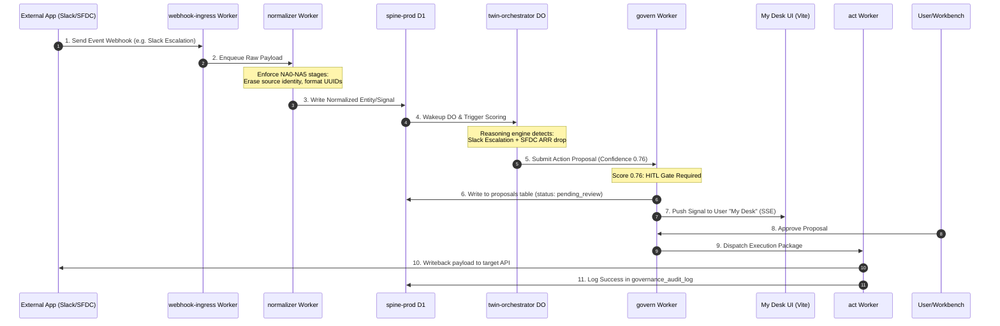

# IntegrateWise Feature Mapping Document: Journey, Flow, & Infrastructure

**Canonical Reference:** [docs/architecture/CANONICAL_PLATFORM_ARCHITECTURE.md](docs/architecture/CANONICAL_PLATFORM_ARCHITECTURE.md)

> This document is downstream of the Canonical Platform Architecture. When this document contradicts the canonical architecture, the canonical architecture wins.

This document maps every core feature of the IntegrateWise Continuity Bridge to its respective **User Journey step**, **System Data Flow**, and **Cloudflare/Replit infrastructure runtime**.

---

## 1. Core Feature Matrix Mapping

| Feature                                 | User Journey Step                                                                     | System Data Flow                                                                                              | Cloudflare Infrastructure                                                                                                | Replit / Local Dev Simulation                                             |
| --------------------------------------- | ------------------------------------------------------------------------------------- | ------------------------------------------------------------------------------------------------------------- | ------------------------------------------------------------------------------------------------------------------------ | ------------------------------------------------------------------------- |
| **Multi-Tenant Ingress Authentication** | **Activation & Discovery**:<br>User inputs Gateway JWT to identify context workspace. | JWT Bearer verification → Tenant ID claim extraction → context routing → `x-tenant-id` header injection.      | • Hono Gateway Worker<br>• `SESSIONS_PROD` KV namespace<br>• JWKS signing cache                                          | Local Hono server (port 8786) with mock JWT signing key validation.       |
| **Unified Capability Discovery**        | **Onboarding / Value**:<br>AI client asks "What can I do for this tenant?".           | Gateway reads `ENDPOINT_REGISTRY` KV → dynamically filters list based on plan tier.                           | • `ENDPOINT_REGISTRY` KV<br>• gateway worker                                                                             | Mock JSON capability registry loaded into memory via `discovery.ts`.      |
| **8-Stage Webhook Normalization**       | **Value (60-sec setup)**:<br>External events sync into the Spine.                     | Ingress worker → Queue → Normalizer (NA0–NA5 stages) → D1 Spine writer.                                       | • `webhook-ingress` worker<br>• `CONNECTOR_SYNC_QUEUE` Queue<br>• `normalizer` worker<br>• `integratewise-spine-prod` D1 | Stdio raw payload normalization piping using mock Webhook emitter.        |
| **Stateful Twin Orchestration**         | **Daily Active Workflow**:<br>Twin observes context timeline.                         | Event arrival → trigger scoring → Twin DO loads active window → proposal generation.                          | • `twin-orchestrator` Durable Object<br>• `integratewise-spine-cache` D1<br>• Workers AI / OpenRouter                    | Local memory store with SQLite mock representing the tenant DO instance.  |
| **Governance Gates ( HITL / Auto )**    | **Exception Governance**:<br>User reviews / approves AI actions.                      | Twin proposal → confidence scoring → Auto-approve (≥0.85) OR Handoff to My Desk (0.60–0.84) → D1 audit write. | • `govern` worker<br>• `proposals` D1 table<br>• `governance_audit_log` D1 table                                         | D1 proposals migration file applied locally using wrangler D1 migrations. |
| **Capability ADK Resolution**           | **Daily Active Workflow**:<br>Invoking capabilities dynamically.                      | Request → Integration Manager checks plan tier and connector status → routes execution path.                  | • `@integratewise/integration-manager` package<br>• `ENDPOINT_REGISTRY` KV                                               | Stdio capability resolver unit tests with mock ResolverContext.           |
| **Memory Consolidation & Decay**        | **Memory Accumulation**:<br>Insights and decisions compound.                          | Action outcomes → vector indexing → semantic search → periodic consolidation / decay.                         | • `continuity` worker<br>• `integratewise-embeddings` Vectorize index<br>• `org_memory` D1 table                         | Mock cosine similarity search utility mimicking Vectorize.                |
| **Inbound MCP SSE Gateway**             | **AI Assistant Ingress**:<br>Cursor/Claude connects to the Bridge.                    | SSE handshake → JWT verification → tool catalog loading → tools execution mapping.                            | • `mcp-server` worker<br>• `SESSIONS_PROD` KV namespace                                                                  | Local SSE connection server with cursor-mcp-connector verification.       |

---

## 2. Ingress-to-Writeback Loop Trace (System Flow)



---

## 3. Infrastructure Details: Cloudflare vs. Replit / Local

### A. Cloudflare Native Setup

1.  **Hono Gateway (`apps/gateway`)**:
    - Acts as the central reverse proxy.
    - Strips inbound `x-tenant-id` to prevent spoofing, extracts it from signed Gateway JWTs, and injects it back before invoking downstream bindings.
2.  **MCP Server (`apps/mcp-server`)**:
    - SSE (Server-Sent Events) endpoint allowing Cursor, Claude, or Perplexity to connect via a single JWT.
    - Exposes a read-only capability catalog, ensuring all writes route through the `govern` approval queue.
3.  **D1 Storage (`integratewise-spine-prod` & `integratewise-spine-cache`)**:
    - `integratewise-spine-prod`: Central, rebuildable operational cache containing active entities, bindings, and active queues.
    - `integratewise-spine-cache`: Central session cache containing proposals, audit logs, and DO state metadata.
4.  **Vectorize**:
    - Indexes organizational memory (`integratewise-embeddings`) and indexed docs (`integratewise-knowledge`) using 1536 dimensions.

### B. Replit / Local Dev Simulation

When running in Replit or a local dev shell, the serverless cloud bindings are simulated via Wrangler:

1.  **Miniflare / Wrangler Dev**:
    - Downstream Workers are mounted as local service bindings.
    - D1 databases are simulated via local SQLite databases (`.wrangler/state/v3/d1`).
2.  **Mock KV Namespaces**:
    - Local directory caches simulate `SESSIONS_PROD` and `ENDPOINT_REGISTRY` values.
3.  **Local Stdio Bridge**:
    - A local Node aggregator (`scripts/mcpflare-aggregator.mjs`) mimics the SSE gateway, allowing local testing inside IDEs (Cursor/Kiro).

---

## 4. Integration Manager Pluggability Routing

The Integration Manager controls swappability using dynamic resolvers:

```
                  ┌──────────────────────┐
                  │  Capability Request  │
                  └──────────┬───────────┘
                             │
              [1. CapabilityResolver.resolve()]
                             │
                             ▼
               Plan Tier & Connector Checks
                             │
                             ▼
             ┌───────────────────────────────┐
             │   IntegrationManager Router   │
             └───────────────┬───────────────┘
                             │
            ┌────────────────┼────────────────┐
            ▼                ▼                ▼
     [Auth Provider]   [Database Target]   [Deployment Target]
      - Gateway JWT     - Local D1          - Cloudflare Workers
      - Clerk           - Neon Postgres     - Vercel (Next.js)
      - Descope         - Supabase DB       - AWS Lambda
```

- **System of Record vs. Cache**: Relational data resides in the PostgreSQL instance of choice (Neon/Supabase) and is accessed via HyperDrive. Cloudflare D1 acts strictly as the temporary operational edge cache.
