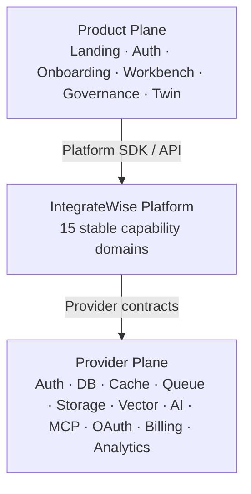
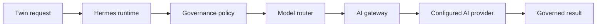

# IntegrateWise Platform Architecture

## Executive Summary

IntegrateWise is an **operational continuity workspace**. It brings context from the systems a company already uses into a governed, role-aware product experience. The platform does not replace every system of record; it creates a coherent operational layer across them.

The system is built around one non-negotiable separation:

> **Product owns experience. Platform owns capability. Providers are configurable execution substrates.**

This keeps user-facing workflows independent of infrastructure vendors, AI vendors, and execution transport. Product surfaces call stable Platform contracts. Provider adapters implement those contracts. Deployment configuration determines which adapters are active.

## The Three Planes



### Boundary rules

- Product code consumes Platform capabilities and never selects providers.
- Platform domains own contracts, canonical state boundaries, policy, and resolution.
- Provider adapters are the only layer that imports vendor SDKs or bindings.
- Deployment configuration selects infrastructure. Application architecture does not.

## The 15 Platform Domains

| #   | Domain        | Platform responsibility                                                               |
| --- | ------------- | ------------------------------------------------------------------------------------- |
| 01  | Identity      | Authentication contract, sessions, users, organizations, RBAC, and service identity.  |
| 02  | Tenancy       | Tenant lifecycle, isolation, memberships, environments, and tenant context.           |
| 03  | Configuration | Runtime, provider, tenant, feature-policy, and secrets-reference configuration.       |
| 04  | Spine         | Canonical entities, identifiers, state ownership, entity graph, and canonical writes. |
| 05  | Memory        | User, work, and organization memory; retrieval; promotion; compaction; lifecycle.     |
| 06  | Continuity    | Context bundles, hydration, workspace transitions, and operational history.           |
| 07  | Integration   | Connector catalog, connection lifecycle, OAuth abstraction, sync, and ingestion.      |
| 08  | Capability    | Capability registry, tools, actions, permissions, and provider-backed capabilities.   |
| 09  | AI            | AI runtime, models, providers, gateway, routing, embeddings, and reranking.           |
| 10  | Governance    | Policy, evidence, approvals, HITL, audit, and AI/action permission boundaries.        |
| 11  | Execution     | Jobs, workflows, queues, orchestration, retries, schedules, and event execution.      |
| 12  | Communication | Email, notifications, webhooks, delivery channels, and templates.                     |
| 13  | Commercial    | Plans, entitlements, metering, usage, and billing abstraction.                        |
| 14  | Operations    | Observability, audit logs, health, analytics, telemetry, and admin operations.        |
| 15  | Developer     | SDKs, API contracts, MCP exposure, webhooks, CLI, schemas, and extensions.            |

Domains are stable even when underlying providers change.

## Provider Independence

Every infrastructure concern is expressed through a Platform contract and implemented by one or more adapters. A product surface asks for capability, not a vendor.

| Concern                  | Platform contract           | Example interchangeable adapters                                       |
| ------------------------ | --------------------------- | ---------------------------------------------------------------------- |
| Canonical state          | `SpineStore`                | Supabase, Postgres, D1                                                 |
| Authentication           | `AuthProvider`              | Descope, Clerk, Supabase Auth, custom OIDC                             |
| Cache                    | `CacheProvider`             | Cloudflare KV, Upstash, Redis, memory                                  |
| AI inference             | `AIProvider`                | OpenAI, Anthropic, Google, OpenRouter, Azure, Bedrock, local inference |
| AI transport             | `AIGateway`                 | Direct, Cloudflare AI Gateway, OpenRouter, LiteLLM, internal Hermes    |
| Operational integrations | Connector / OAuth contracts | Nango, MCP, direct OAuth, custom connectors                            |

### AI decision chain

Twin requests intelligence by intent. Hermes orchestrates execution. Governance determines permission. The model router selects the capability and model. The gateway selects transport. The provider performs inference.



No model owns truth or workflow state. No product surface needs to know a model name or AI vendor.

## Canonical State and Governance

Spine is canonical truth. Models, connectors, agents, and workflows do not write directly to canonical state. Writes cross governed state boundaries so that policy, evidence, approvals, execution, and audit stay available.

Every governed proposal can communicate:

- what is proposed and why;
- the actor, entity, capability, and evidence involved;
- policy outcome, risk level, and required approval;
- execution status and audit reference.

This turns governance into a legible product experience rather than a hidden confirmation step.

## Integration and Configuration Are Different Authorities

| Question          | Integration Manager                                                          | Configuration Manager                                                          |
| ----------------- | ---------------------------------------------------------------------------- | ------------------------------------------------------------------------------ |
| Primary authority | What external systems are connected?                                         | How should the platform behave?                                                |
| Owns              | Connector registry, connections, OAuth lifecycle, sync, health, capabilities | Runtime, tenant, provider, feature-policy, and secrets-reference configuration |
| Output            | Connected capability                                                         | Effective configuration                                                        |
| Credentials       | Manages references and connection binding                                    | Never owns credentials                                                         |

The Integration Manager reaches external systems. The Configuration Manager resolves active adapters and runtime behavior. Neither authority replaces the Platform contract.

## Product/Platform Delivery Contract

The Live product builds against the same Platform contract in all environments.

```text
Page → Surface → Hook / Query → Platform Client → Platform API
```

- The frontend never imports provider SDKs.
- UI components do not branch on mock versus remote mode.
- Mock APIs reproduce real contracts, status codes, pagination, errors, and state transitions.
- A UI view model may adapt data for presentation but does not become state authority.

The canonical API namespace starts with `/api/platform/v1` and is partitioned by the 15 domains. This allows a working product to use mocks while Platform services mature behind the same surface.

## Admin Boundary

**Admin experience belongs to Live. Admin authority belongs to Platform.**

The Live product provides operator-facing administration screens. The Platform provides governed APIs for tenant operations, provider configuration, model routing, connector administration, health, entitlements, audit, and operational controls.

## Architecture Laws

1. Product owns experience. Platform owns capability.
2. Platform contracts are canonical; providers are replaceable.
3. Provider SDKs do not cross into product code or domain services outside their adapters.
4. No model, agent, connector, or workflow writes directly to Spine.
5. Deployment configuration selects infrastructure; application architecture does not.

## What This Enables

- A coherent product can evolve while back-end providers change.
- AI can be governed by policy, data sensitivity, cost, latency, and capability needs.
- Connected-tool data can become operational context rather than isolated events.
- The same product surface works with mock APIs today and a live Platform runtime tomorrow.
- Teams can add providers and connectors without redesigning user workflows.
