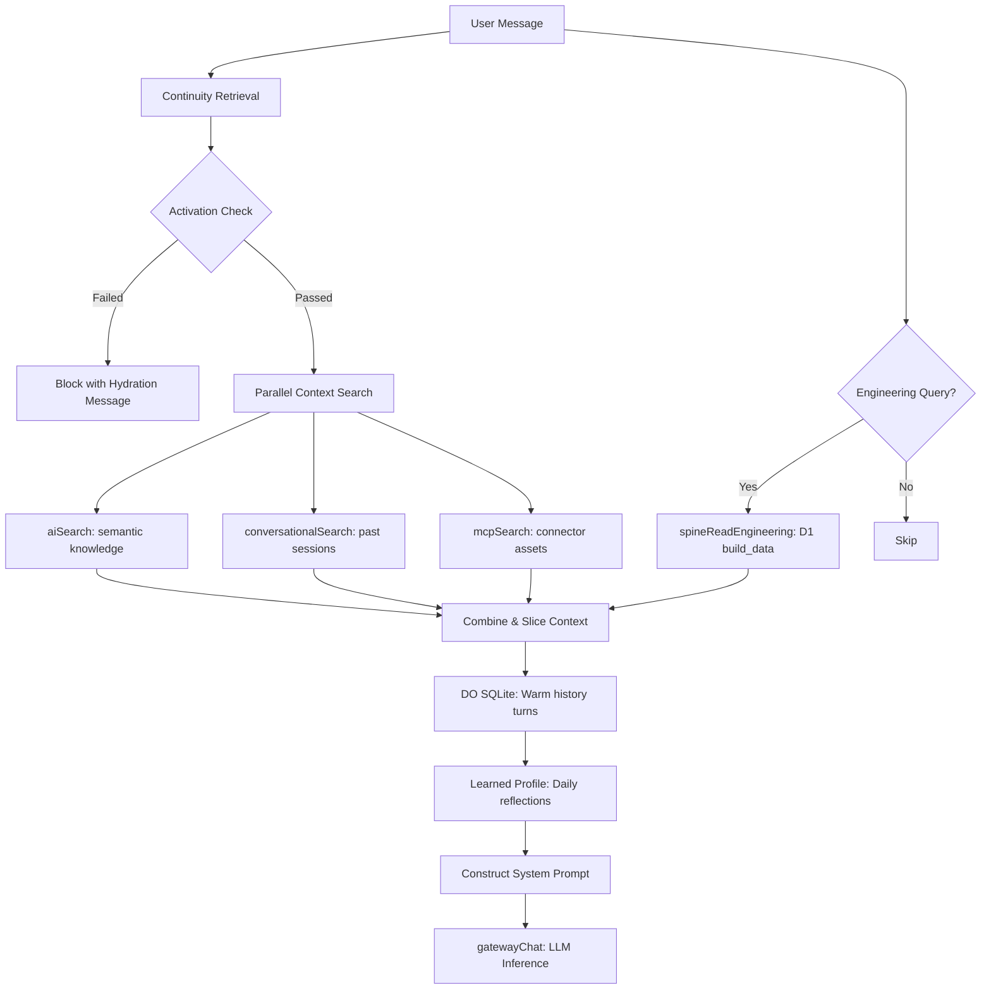

# User Journey ≠ System Journey — Canonical Blueprint

## v3.7 — Frontend Layered Stack & Backend Stages Map

**Date:** June 18, 2026  
**Status:** Canonical architecture doctrine  
**Supersedes:** journey sections scattered across README.md, USER_FLOW_AND_VIEWS.md, FRONTEND_LAYER_MAP.md
**Companion doctrines:** [WORKBENCH_DOCTRINE.md](WORKBENCH_DOCTRINE.md), [DETAILED_USER_FLOWS_AND_SYSTEM_PATHS.md](DETAILED_USER_FLOWS_AND_SYSTEM_PATHS.md)

**Canonical Reference:** [CANONICAL_PLATFORM_ARCHITECTURE.md](./CANONICAL_PLATFORM_ARCHITECTURE.md)

> This document is downstream of the Canonical Platform Architecture. When this document contradicts the canonical architecture, the canonical architecture wins.

---

## 1. The Fundamental Model (User Spec)

All layers below are Workbench projections over governed Adaptive Spine context. No layer owns canonical truth; each layer renders the right projection for the user, Twin, governance, knowledge, or domain purpose.

Every user gets exactly two views — never more:

- **Personal** (always `PERSONAL` domain)
- **One Work workbench** (chosen once during onboarding — e.g. `CUSTOMER_SUCCESS`, `SALES`, `REVOPS`, `MARKETING`, `PRODUCT_ENGINEERING`, `BIZOPS`, etc.)

### Differentiation rules (locked):

- **L1 (main workbenches) + Memory layer (L4)** are differentiated by the chosen domain.
- **Everything else** (L2 overlay, L3 Twin, L5, L6, L7) is shared.

_Data Invariant:_ Data always comes from D1 Spine projections (never raw tool data). The chosen domain decides which `${domain}_data` partition (e.g. `grow_data`, `build_data`) you see in L1.

---

## 2. High-Level Flow

```text
L0 Onboarding (choose useCase + department → domain)
        ↓
AppShell (restores or sets activeDomain + WORK/PERSONAL preference)
        ↓
WorkspaceShellNew
        ├── Personal view → PERSONAL domain content
        └── Work view   → chosen domain content (L1)
                │
                ├── L2 Overlay (⌘J drawer) — always available on top
                ├── L3 Twin (shared chat/reasoning)
                ├── L4 Memory Hub (differentiated)
                ├── L5 Operations (shared)
                ├── L6 Execution (shared)
                └── L7 Governance (shared, HARD GATE)
```

Backend system stages run underneath (S1–S12).

## 2.5 Architecture Diagram (v3.7 Canonical)

```mermaid
flowchart TB
    %% User Surface
    subgraph User["👤 User Surfaces (L0–L7)"]
        direction TB
        L0["L0 Onboarding<br/>(domain selection)"]
        L05["L0.5 Always-On<br/>(background DO crons)"]
        L1["L1 Workbench<br/>(domain-specific dashboards)"]
        L2["L2 Overlay<br/>⌘J Intelligence Drawer"]
        L3["L3 Twin Workbench<br/>(CF-native chat + voice)"]
        L4["L4 Knowledge<br/>(Memory Hub)"]
        L5["L5 Operations<br/>(Signals + Proposals)"]
        L6["L6 Execution<br/>(Handoff + Playbooks)"]
        L7["L7 Governance<br/>(HARD GATE Approvals)"]

        L0 --> L1
        L1 --> L2 & L3 & L4 & L5 & L6 & L7
    end

    %% Gateway
    GW["🚪 Gateway<br/>(services/gateway)<br/>JWT verify • Rate limit • D1-direct projections"]

    User -->|Browser / MCP| GW

    %% Core Services
    subgraph Services["⚙️ Cloudflare Workers Services"]
        direction LR
        Pipeline["services/pipeline<br/>Normalizer (8-stage) + Spine Writer"]
        Connector["services/connector<br/>Loader + MCP Bridge + Sync"]
        Intelligence["services/intelligence<br/>Think • Act • Govern"]
        Knowledge["services/knowledge<br/>KB Ingestion + Org Memory"]
        AgentRuntime["services/iw-agent-runtime<br/>TwinAgent DO + TenantBrainDO<br/>(Cloudflare Agents SDK)"]
    end

    GW --> Services
    Services -->|write entities| Data

    %% Data Plane
    subgraph Data["🗄️ Cloudflare Data Plane (Single Source of Truth)"]
        direction TB
        D1["D1 (integratewise-spine-cache)<br/>tenant_spine_config<br/>decide_data | build_data | grow_data | run_data | cross_data"]
        KV["KV (hot cache + signals)"]
        Vectorize["Vectorize + AI Search<br/>(semantic knowledge)"]
        DOs["Durable Objects<br/>Twin sessions • FolderWatcher • HITL"]
        R2["R2 (artifacts, docs)"]
        Queues["Queues<br/>pipeline-process • intelligence-events • ..."]
    end

    %% External World
    subgraph External["🔌 External World"]
        Connectors["Connectors (Nango, direct MCP, APIs)"]
        Execution["Execution Providers<br/>(customer local agents, APIs, Playwright)"]
    end

    Connectors -->|raw data| Connector
    AgentRuntime -->|propose + handoff| L6
    L7 -.->|x-approval-token| L6
    L6 -->|playbook / outcome| Execution
    Execution -->|feedback| Knowledge

    %% Twin Context Flow
    L3 -.->|assembleContinuity| Knowledge
    Knowledge -.->|hydrate| AgentRuntime
    Data -.->|D1-direct projections| GW

    %% Key Flows
    Pipeline --> Data
    Connector --> Pipeline
    Intelligence --> L2 & L5 & L7
    AgentRuntime --> L3
    L4 <--> Knowledge

    classDef layer fill:#e8f5e9,stroke:#2e7d32
    classDef service fill:#e3f2fd,stroke:#1565c0
    classDef data fill:#fff3e0,stroke:#e65100
    classDef gate fill:#ffebee,stroke:#c62828

    class L0,L05,L1,L2,L3,L4,L5,L6,L7 layer
    class Pipeline,Connector,Intelligence,Knowledge,AgentRuntime, GW service
    class D1,KV,Vectorize,DOs,R2,Queues data
    class L7 gate
```

**Legend**

- **User Layers (left)**: What the human sees and interacts with.
- **Services (center)**: The active engine (all Cloudflare Workers).
- **Data Plane (bottom-right)**: 100% Cloudflare (D1 is the Spine of truth).
- **Flows**: Ingestion (right→left), Intelligence + Twin (center), Governance gate (red), Execution handoff (external).

This diagram reflects the locked v3.7 state (DECISION 22/23 + L0–L7 + S1–S12).

See the companion documents [WORKBENCH_DOCTRINE.md](WORKBENCH_DOCTRINE.md) and [DETAILED_USER_FLOWS_AND_SYSTEM_PATHS.md](DETAILED_USER_FLOWS_AND_SYSTEM_PATHS.md) for the projection doctrine, exhaustive step-by-step user flows per layer, system stage details (S1–S12), end-to-end examples (onboarding, intelligence→governance→execution loop, Twin hydration), and data invariants.

Backend system stages run underneath (S1–S12).

---

## 3. Detailed Layer Breakdown

| Layer    | User Intent                               | What You See                                                                            | Domain Handling                                                                             | Backend Stages                                      | Current Status / How It Is Wired                                                                                                                                                          |
| :------- | :---------------------------------------- | :-------------------------------------------------------------------------------------- | :------------------------------------------------------------------------------------------ | :-------------------------------------------------- | :---------------------------------------------------------------------------------------------------------------------------------------------------------------------------------------- |
| **L0**   | Onboarding                                | 4-step wizard (Welcome → Profile → Goals → Connect)                                     | `resolveDomain` (useCase, department) produces the single work domain (no default for work) | S1–S3 (connect + initial hydration)                 | **Fully implemented.** Calls initializeWorkspace({ domain }). Tracks loading timeouts for initial loaders. Active domain is written to profile + localStorage and JWT metadata.           |
| **L0.5** | Always-On Operating Layer                 | No direct UI (background)                                                               | N/A (tenant + domain context)                                                               | Background jobs, crons, DO alarms                   | **Non-UI background layer.** Powered by stateful TwinAgent (TwinAgent DO daily reflex cron + TenantBrainDO DO per-tenant 15-min HITL timeout).                                            |
| **L1**   | User Workbench                            | Domain-specific dashboards (e.g. Account Success, Sales Pipeline, Personal Hub, BizOps) | Strictly differentiated. `activeDomain` + `contentDomain` decides the L1 surface            | S5 Spine Write + S4 Entity Resolution + projections | **Most mature layer.** Uses `DOMAIN_CONTENT_MAP` + per-domain modules (success/, salesops/, personal/, bizops/). Fetches pass `?workDomain=DOMAIN`. Design tokens (forest/gold) enforced. |
| **L2**   | Intelligence Overlay                      | `⌘J` sliding drawer/panel (signals, insights, think, govern, context, evidence)         | Shared on top of current L1 view. Filters by active domain                                  | S6 Intelligence                                     | **Present and functional.** Cognitive signals strip + insight panel. Uses `cognitive-overlay-panel-provider`.                                                                             |
| **L3**   | Twin Workbench                            | Chat interface + reasoning surface                                                      | Shared (Twin sees the user's full context)                                                  | S10 Twin Runtime                                    | **Native Cloudflare DOs.** Shipped as `TwinWorkbench` + `use-twin-chat` hook (SSE). No OpenWebUI, no Agent Zero. Context seeds from L1 entities + L2 insights.                            |
| **L4**   | Knowledge Workbench ("Remember")          | Memory Hub: semantic search, org memory, documents, AI sessions, promoted knowledge     | Differentiated (memory layer)                                                               | S7 Memory                                           | **Routed shell.** Shipped as `memory-hub.tsx` in `UnifiedShell`. Calls `/api/v1/knowledge` endpoints. Accepts `domain` prop and queries workspace-partitioned governance memory.          |
| **L5**   | Operations Workbench ("Plan")             | Situations board, signals stream, proposal pipeline                                     | Shared (but can scope to current work view)                                                 | S6 Intelligence                                     | **Routed shell.** Shipped as `operations-workbench.tsx`. Pulls situations/signals/proposals via `/api/v1/intelligence` + `listProposalsForOps`.                                           |
| **L6**   | Execution / Handoff Workbench ("Execute") | Ready queue (approved), running executions, history + writeback audit                   | Shared                                                                                      | S11 Execution + S12 Writeback                       | **Routed shell.** Shipped as `execution-workbench.tsx`. Shows approved, executing, completed proposals. Governance gate compliance checked. 24h reminder tracking logic.                  |
| **L7**   | Governance Workbench ("Govern")           | Approval queue (HITL), policies, full audit trail                                       | Shared + HARD GATE                                                                          | S8 Governance (HARD GATE)                           | **Routed shell.** Shipped as `governance-workbench.tsx`. Approve/reject actions, policy configuration. This is the HARD GATE — no token, no execution.                                    |

---

## 4. How the Layers Are Actually Wired Today

1. `AppShell` decides domain + `workspacePreference` (`"PERSONAL"` or `"WORK"`) from onboarding or restored D1 profile.
2. `WorkspaceShellNew` computes `contentDomain = activeView === "PERSONAL" ? "PERSONAL" : activeDomain`.
3. `ContentRouter` looks up `DOMAIN_CONTENT_MAP[contentDomain][moduleId]`.
4. Every domain map is augmented with shared `LAYER_MODULES`:

```javascript
const LAYER_MODULES = {
  twin,
  memory,
  operations,
  execution,
  governance,
};
const withLayerModules = (map) => ({ ...map, ...LAYER_MODULES });
```

5. L4–L7 all wrap content in the common `LayerShell` (consistent header, badge "L4"/"L5"/"L6"/"L7", system wire label, design tokens).

---

## 5. Backend System Stages (the invisible engine)

| Stage   | Purpose                | Key Component                                                                  |
| :------ | :--------------------- | :----------------------------------------------------------------------------- |
| **S1**  | Connectivity           | Connectors / Nango / MCP                                                       |
| **S2**  | Loader                 | Ingest raw data                                                                |
| **S3**  | Normalizer (8-stage)   | `services/pipeline`                                                            |
| **S4**  | Entity Resolution      | Spine deduping                                                                 |
| **S5**  | Spine Write            | D1 `*_data` partitions (the source of truth)                                   |
| **S6**  | Intelligence           | Signals, think, proposals (`services/intelligence`)                            |
| **S7**  | Memory                 | Org + personal + conversational (`services/knowledge` + `services/continuity`) |
| **S8**  | Governance (HARD GATE) | Approvals, policies, audit                                                     |
| **S9**  | Continuity Bridge      | Assembled context                                                              |
| **S10** | Twin Runtime           | `iw-agent-runtime` (DOs)                                                       |
| **S11** | Execution              | Handoff / playbook dispatch                                                    |
| **S12** | Writeback              | Record outcomes                                                                |

_Important:_ The UI (all layers) only ever reads projections assembled from the Spine. Raw data is never shown.

---

## 6. Key Invariants

- **HARD GATE:** L7 is the only place that can mint an approval. L6 execution surface is dead without it.
- **Single Source of Truth:** D1 (`tenant_spine_config` + domain partitions). Gateway serves many reads directly.
- **Design System:** `--iw-forest` / `--iw-gold` + `iw-` classes (old blue/purple leaks have been cleaned in active paths).
- **Customer Zero Verification:** 7 real checkpoints (identity, connectors, hydration, spine, memory, continuity, twin) — all D1 queries, visible in admin.
- **No direct execution in product** except for IntegrateWise's own ops (Customer Zero).

---

## 7. Current Maturity (June 2026)

- **L0, L1, L2, L3:** Quite solid and in active use.
- **L4–L7:** "Routed shells" — they exist, use consistent `LayerShell`, call real APIs (`intelligence/proposals`, `knowledge/*`, etc.), and are available in every workbench. They are functional but lighter on custom domain-specific UI than L1.
- **L0.5:** Running in production background (DOs + crons).

_This is the actual as-built architecture after the recent fixes for domain scoping, design tokens, and layer consistency._

---

## 8. Exact Data Flow: L7 (Governance) → L6 (Execution)

Every execution proposal inside the product follows a governed, immutable lifecycle to maintain context integrity and enforce the execution boundary:

1. **Proposal Draft / Pending:** When the Twin or background intelligence normalizers detect a high-risk situation, a proposal is written to the D1 `governance_data` table in a `pending_review` status.
2. **Governance Workbench (L7) Approval:**
   - The operator opens L7 and clicks "Approve".
   - The web app sends a POST request to `/api/v1/intelligence/proposals/:id/approve` handled by `approveProposal()` in [services/govern/src/proposal.ts](file:///Users/nirmal/Github/integratewise-live/services/govern/src/proposal.ts).
   - The system checks `canTransition(status, 'approved')` to enforce valid state transition.
   - The status is updated to `approved`, the decision is cryptographically signed using a `signatureKey` via `logDecision()`, and written to the Spine audit logs.
3. **Execution Package Minting:**
   - Upon approval, the system automatically mints a first-class **Execution Package** inside the D1 `execution_packages` table.
   - This package captures the exact workflows (steps), tools (schemas), and context JSON payload required to execute the action.
4. **Execution Handoff (L6):**
   - **Customer Zero Flow (Internal Hermes Execution):**
     - `executeAction()` triggers asynchronously.
     - The proposal's state is set to `executing` in D1.
     - The system resolves the target entity type domain (e.g. `grow`, `build`) and executes direct SQLite SQL queries (`INSERT`/`UPDATE`) on the domain partitions (e.g., `grow_data`, `build_data`).
     - Relationships are recorded in `link_data`.
     - Execution outcomes and lineage are recorded in `recordLineage()`.
     - The proposal and execution package statuses transition to `completed`.
   - **External Customer Flow (Handoff):**
     - The Execution Package is exported in a vendor-neutral canonical JSON format.
     - The customer's execution agent (e.g., OpenClaw, crewAI, local CLI) fetches the package and updates status to `HANDED_OFF`.
     - The execution runs inside the customer's firewall.
     - Upon completion, the external runtime reports results back via a POST request to `/api/v1/handoff/outcome` containing the governance token. The gateway verifies the token, resolves status to `COMPLETED`, and writes the execution memory back to the Spine.

---

## 9. Context Hydration: How the Twin (L3) Gets Context

The Twin (`iw-agent-runtime`) is stateful and runs entirely inside Cloudflare Durable Objects. When a user sends a chat message, the Twin hydrates its context using a multi-step grounding pipeline before invoking the LLM:



1. **Step 1: Continuity Assembly & Activation Gate:**
   - The Twin calls `assembleContinuity()` to fetch the user's conversational, organizational, and personal memory.
   - `evaluateActivation()` verifies if the tenant's memory database has passed the minimum threshold (e.g., 3+ total memories, 1+ promoted). If not, the Twin refuses to answer, providing a status message about current connectors and hydration progress to prevent hallucinations.
2. **Step 2: Parallel Context Search:**
   - The Twin performs parallel queries against:
     - `aiSearch`: Semantic chunks from the knowledge service.
     - `conversationalSearch`: Past chat memories in the hot cache.
     - `mcpSearch`: Connector resource schemas.
3. **Step 3: Engineering Intent Detection:**
   - If the query contains engineering-related terms (e.g., repository, pull request, merge, sprint, commit), the Twin calls `spineReadEngineering()`.
   - This performs a D1-direct read on the `build_data` partition (never querying live APIs), appending PRs, active repos, and blockers to the prompt context.
4. **Step 4: DO SQLite Warm Conversation Turns:**
   - The DO queries its local SQLite database `conversation_turns` table to fetch the 10 most recent message exchanges in the current session.
5. **Step 5: Evolving Personal Profile:**
   - The Twin loads its `learned_profile` block, which contains communication styles, risk tolerance signals, and success patterns extracted by the `dailyReflection` cron job.
6. **Step 6: Prompt Assembly & Gateway Chat:**
   - The Twin formats the retrieved context block, profile, and system prompt, and calls `gatewayChat()` to route the request through OpenRouter/OpenAI (with Workers AI fallback).
7. **Step 7: Memory Event Emission:**
   - The turn is written to local DO SQLite, and a session event is dispatched asynchronously to the continuity pipeline (`emitTriageInput`) to enrich the memory substrate.

---

## 10. Customer Zero Verification: The 7-Stage Checklist

The Customer Zero Verification state (implemented in [services/gateway/src/workspace-spine.ts](file:///Users/nirmal/Github/integratewise-live/services/gateway/src/workspace-spine.ts)) is a D1-direct checklist used to verify that a tenant is fully hydrated and functioning:

| Stage | Checkpoint Label | D1 Verification Query                                  | Target Done Condition                             |
| :---- | :--------------- | :----------------------------------------------------- | :------------------------------------------------ |
| **1** | Identity Schema  | `SELECT schema_version FROM tenant_spine_config`       | Row exists and `schema_version` is populated      |
| **2** | Connectors       | `SELECT connected_connectors FROM tenant_spine_config` | At least one connector is recorded as connected   |
| **3** | Hydration        | Derived from latest connector jobs                     | Initial "creamy" ingestion finished successfully  |
| **4** | Spine            | `SELECT COUNT(*) FROM build_data / grow_data / ...`    | Total count of entities across all partitions > 0 |
| **5** | Memory           | `SELECT COUNT(*) FROM memory_promotion_audit`          | Audit records and promoted count > 0              |
| **6** | Continuity       | `SELECT topic FROM org_memory`                         | Promoted org memory context records are populated |
| **7** | Twin             | Computed based on memories & thresholds                | `promotedCount >= 1` and `totalMemories >= 3`     |
