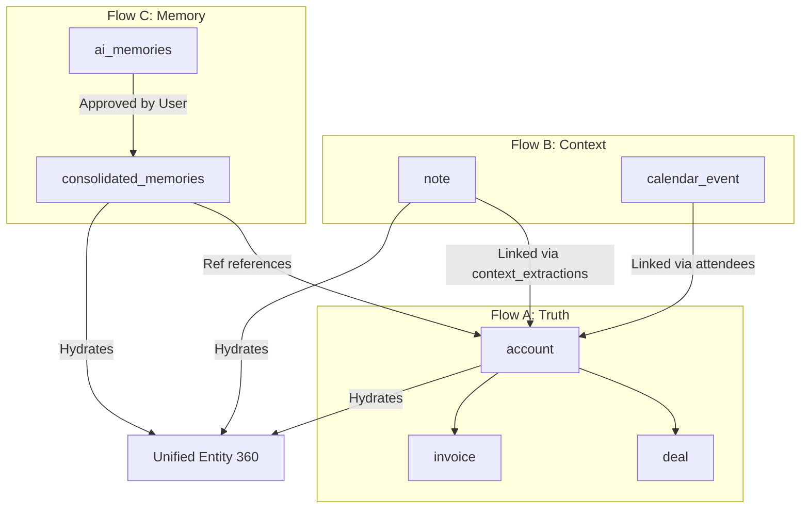

# IntegrateWise Entity Inventory (31 Core Entities)

This document is the canonical inventory of the 31 primary entities in the IntegrateWise Spine DB and domain schemas under Architecture v3.0. It defines their purpose, key attributes, relationships, and how they bridge L1 Workspaces and L2 Cognitive Overlays.

---

## 🟢 Core Spine (Unified Schema)

These entities represent the foundation of the Spine and are used across all departments to maintain standard identity and activity lines.

### 1. `account`

- **Domain**: Customer Success / General
- **Purpose**: Mapped record of a client organization. Resolves identities across HubSpot, Salesforce, and Stripe.
- **Core Attributes**: `id` (UUID), `tenant_id`, `name`, `domain`, `arr`, `health_score`.
- **Relationships**: Has many `contact`s, `deal`s, and `ticket`s.

### 2. `contact`

- **Domain**: Customer Success / Sales
- **Purpose**: Individual stakeholders linked to accounts. Resolves a Person profile across Gmail, HubSpot, and Slack.
- **Core Attributes**: `id` (UUID), `tenant_id`, `name`, `email`, `role`, `source_system`.
- **Relationships**: Belongs to `account`.

### 3. `task`

- **Domain**: General Operations
- **Purpose**: Any task, to-do, or ticket from Jira, Linear, or Asana.
- **Core Attributes**: `id` (UUID), `tenant_id`, `title`, `status` (Todo | In_Progress | Done), `priority`.
- **Relationships**: Optionally links to `account` or `contact`.

### 4. `note`

- **Domain**: General Operations
- **Purpose**: Rich text documents, Google Docs, or Notion pages mapped to the Spine.
- **Core Attributes**: `id` (UUID), `title`, `body_md`, `tags`, `source_tool`.
- **Relationships**: Belongs to `account`, has many `evidence_ref`s.

### 5. `calendar_event`

- **Domain**: General Operations
- **Purpose**: Calendar meetings retrieved from Google Calendar or Outlook.
- **Core Attributes**: `id` (UUID), `tenant_id`, `title`, `start_time`, `end_time`, `attendees`.
- **Relationships**: Links to `contact`s via attendee emails.

### 6. `conversation`

- **Domain**: General Operations
- **Purpose**: Threads and chat history from Slack or Microsoft Teams.
- **Core Attributes**: `id` (UUID), `source`, `message_count`, `topic`, `participants`.
- **Relationships**: Connects to `contact`s via participants.

### 7. `signal`

- **Domain**: Cognitive Layer (L2)
- **Purpose**: Proactive anomalies or event triggers detected by the Twin from spine changes.
- **Core Attributes**: `id` (UUID), `tenant_id`, `signal_type`, `severity` (low | warn | critical), `description`.
- **Relationships**: Belongs to a source entity (e.g. `account` or `deal`).

---

## 🔵 Customer Success (`cs` Schema)

Entities that drive Account Success, QBRs, renewals, and risk mapping.

### 8. `account_master`

- **Purpose**: Consolidated health profile representing the unified customer record.
- **Relationships**: References `account`.

### 9. `success_plan`

- **Purpose**: Structured milestone plan for achieving client outcomes.
- **Relationships**: Belongs to `account`.

### 10. `risk_register`

- **Purpose**: Identified renewal risks, churn threats, or product drop-offs.
- **Relationships**: Belongs to `account`, linked to `signal`s.

### 11. `engagement_log`

- **Purpose**: Historical record of QBRs, calls, and email cadences.
- **Relationships**: References `account` and `contact`.

### 12. `renewal`

- **Purpose**: Financial projection of upcoming contract renewals.
- **Relationships**: Belongs to `account`.

### 13. `stakeholder_outcome`

- **Purpose**: Quantifiable ROI expectations of individual buyers.
- **Relationships**: Belongs to `contact`.

### 14. `initiative`

- **Purpose**: Projects established to drive account value or resolve issues.
- **Relationships**: Linked to `success_plan`.

### 15. `capability`

- **Purpose**: Product features/modules adopted by the account.
- **Relationships**: References `account`.

### 16. `value_stream`

- **Purpose**: Mapping of client processes optimization metrics.
- **Relationships**: Belongs to `account`.

### 17. `api_portfolio`

- **Purpose**: Mapped external system integrations used by the client.
- **Relationships**: References `account`.

---

## 🟡 Sales & Marketing (`sales` & `marketing` Schemas)

### 18. `deal`

- **Purpose**: Real-time sales opportunities (HubSpot deals / Salesforce opportunities).
- **Relationships**: Belongs to `account`.

### 19. `lead`

- **Purpose**: Qualified prospects entering the pipeline.
- **Relationships**: Links to `contact`.

### 20. `campaign`

- **Purpose**: Marketing demand generation initiatives.
- **Core Attributes**: `id`, `name`, `status`, `cpl`, `mqls`.

### 21. `audience_segment`

- **Purpose**: Targets grouped for campaign execution.
- **Relationships**: Linked to `campaign`.

---

## 🟣 Support & Engineering (`support` & `eng` Schemas)

### 22. `ticket`

- **Purpose**: Customer support issues (Zendesk / HubSpot Tickets).
- **Relationships**: Belongs to `account`, links to `employee` (assignee).

### 23. `csat`

- **Purpose**: Satisfaction ratings collected after ticket resolutions.
- **Relationships**: Belongs to `ticket`.

### 24. `sprint`

- **Purpose**: Engineering development cycles.
- **Core Attributes**: `sprint_id`, `name`, `start_date`, `end_date`, `status`.

### 25. `incident`

- **Purpose**: System outages, SEV1 alerts, or pipeline failures.
- **Relationships**: Linked to `sprint` and `service` mappings.

---

## 🔴 Finance & Operations (`finance` & `hr` Schemas)

### 26. `invoice`

- **Purpose**: Customer billing records from Stripe or QuickBooks.
- **Relationships**: Belongs to `account`.

### 27. `payment`

- **Purpose**: Cleared transactions resolving invoices.
- **Relationships**: Belongs to `invoice`.

### 28. `employee`

- **Purpose**: Internal workspace users, CSMs, or AEs.
- **Core Attributes**: `id`, `name`, `role`, `load` (workload %).
- **Relationships**: Assigned to `account`s and `ticket`s.

---

## ⚙️ Memory & Governance (Flow C)

These entities represent institutional memory and action proposals.

### 29. `ai_memories`

- **Purpose**: Staged raw memories, session summaries, or learnings processed by the Triage Bot.
- **Relationships**: Links to source `conversation` or `signal`.

### 30. `consolidated_memories` (Org Memory)

- **Purpose**: Canonized institutional knowledge promoted to the Book of Projects.
- **Relationships**: Append-only, points to entities via `entity_refs`.

### 31. `action` (Playbook Action)

- **Purpose**: Proposed playbooks or actions needing human-in-the-loop (HITL) approval before execution.
- **Relationships**: References `signal` and target tools.

---

## 🔗 Cross-Surface Relationships Mapping

The following diagram illustrates how the three data flows intersect inside the Unified Entity 360 profile:

