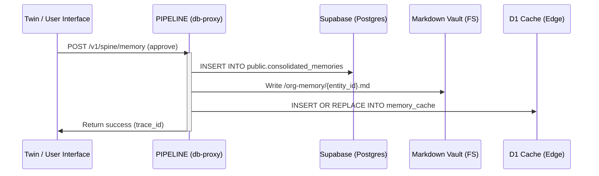

# IntegrateWise Dual-Write Memory Substrate (D1 + Supabase + Vault)

This document specifies the hybrid three-tier database substrate used by IntegrateWise under Architecture v3.0. It maps the Edge Cache (Cloudflare D1/KV), the permanent relational database of record (Supabase + pgvector), and the persistent offline Markdown Vault.

---

## 1. High-Level Substrate Topography

To satisfy both **Law 6 (Memory)** and edge-local performance requirements, IntegrateWise operates a decoupled read-write memory substrate:

```
                  ┌──────────────────────────────────────────────┐
                  │                 Active Worker                │
                  └──────────────────────┬───────────────────────┘
                                         │
                   Reads Edge-Locally    │ Writes Memory Staging
                  ┌──────────────────────┼───────────────────────┐
                  ▼                      ▼                       ▼
            ┌──────────┐           ┌──────────┐            ┌───────────┐
            │    KV    │           │    D1    │            │ PIPELINE  │
            │ (Hot CA) │           │ (SQLite) │            │ (Service) │
            └──────────┘           └──────────┘            └─────┬─────┘
                                                                 │
                                                   Dual-Writes   │
                                                   Simultaneously│
                                                                 ▼
                                                  ┌──────────────┴──────────────┐
                                                  │                             │
                                                  ▼                             ▼
                                          ┌──────────────┐              ┌──────────────┐
                                          │ Supabase DB  │              │ Filesystem   │
                                          │ (pgvector)   │              │ Vault (md)   │
                                          └──────────────┘              └──────────────┘
```

---

## 2. Tier Details & Responsibilities

### Tier 1: Cloudflare Edge (D1 & KV Cache)

- **Role**: Read-only Edge Cache and signal-detection buffer.
- **Technologies**:
  - **Cloudflare D1**: Stores local mirrors of `agent_registry`, `entity360_cache`, `ai_sessions`, and resolved configuration matrices.
  - **Cloudflare KV**: Hot namespace caching for `SCHEMA_CACHE`, `CONNECTOR_STATUS`, and rate-limiting keys with 60-300s TTLs.
- **Rule**: AI reasoning loops (Twin, specialized agents) query D1/KV local views to construct morning context briefs in `< 200ms`.

### Tier 2: Supabase (Fortress DB of Record)

- **Role**: Permanent, normalized, relational source of truth (SSOT).
- **Technologies**: PostgreSQL database with `pgvector` index tracking.
- **Tables**: `entities`, `consolidated_memories`, `actions`, `connectors`, `governance_audit_log`.
- **Rule**: Direct access is strictly banned for edge reasoning agents. Writes are dispatched via the `env.PIPELINE` `/api/v1/db-proxy` endpoint.

### Tier 3: Physical Vault (Markdown Storage)

- **Role**: Permanent offline corporate memory backup.
- **Format**: Clean GitHub-flavored markdown files stored locally at `/org-memory/` under corresponding entity directory trees.
- **Rule**: Human-approved decisions or promoted learnings must write here during the promotion transaction.

---

## 3. The Dual-Write Promotion Loop

When the Triage Bot or human operator approves and promotes a memory summary, the following synchronization chain is executed in a single atomic pipeline transaction:



### Idempotency Check (Stage 7.5 Validation)

To prevent duplicates, the normalizer checks the content hash fingerprint in D1 before starting any database transaction:
$$\text{SHA-256}(\text{tenant\_id} + \text{entity\_type} + \text{source} + \text{content\_hash})$$
If the fingerprint is found in D1, the write is skipped.
